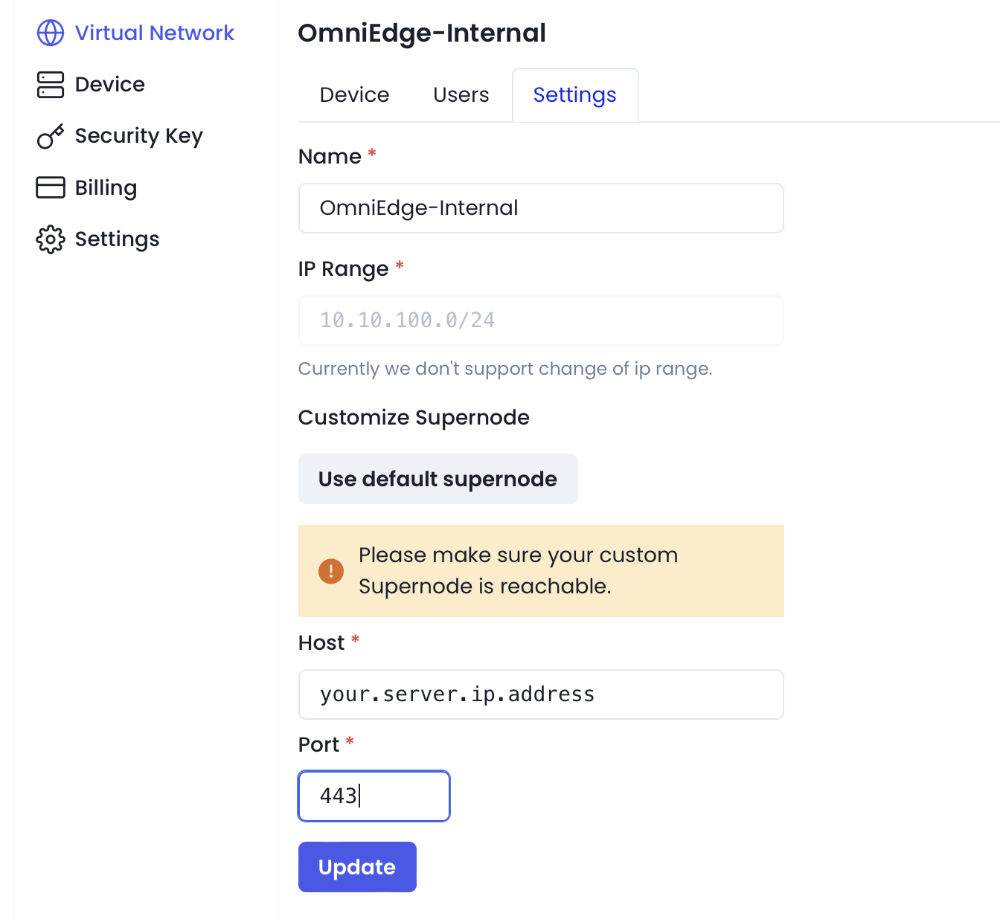

# OmniEdge 

**Bring intranet on the internet**

[【English】](README.md) [【繁体中文】](README/README-zh-Hant.md) [【简体中文】](README/README-zh-Hans.md) 

OmniEdge is an Open source p2p layer 2 VPN infrastructure based on [n2n](https://github.com/ntop/n2n) protocol, a traditional VPN alternative. No central server, easy to scale with less maintenance. What happens in intranet, stays in in intranet.

[【How omniedge works】](https://omniedge.iohttps://omniedge.io/docs/article/architecture) [【Download】](#download-omniedge-apps) [【Public Supernode】](#free-public-supernode) [【Setup Customize Supernode】](#setup-customize-supernode) [【Compile】](#compile) [【Usage】](#usage) [【Use cases】](#use-cases) [【Compare】](#compare) [【Unique】](#the-unique-of-omniedge) [【Press】](#who-are-talking-about-us)

We need your help to translate this README, [OmniEdge Windows UI](https://github.com/omniedgeio/omniedge-windows/tree/dev/languages),[OmniEdge Android UI](https://github.com/omniedgeio/omniedge-android/tree/main/app/src/main/res/values) and [Docs](https://github.com/omniedgeio/docs) to your native language

Chat with us: [🤝 Website](https://omniedge.io) [💬 Twitter](https://twitter.com/omniedgeio) [😇 Discord](https://discord.gg/d4faRPYj)


## Download OmniEdge Apps

- Sign up an account via https://omniedge.io and download the apps for your platform. 
- [Download Binary](https://github.com/omniedgeio/omniedge/releases)


## Free public supernode

We offer public supernodes you are using for starter plans, allocated automatically by your registered IP address via GeoIP. You network may be slow if your IP location is different from your devices. But you can [use your own supernode](https://omniedge.iohttps://omniedge.io/docs/article/install/customize-supernode) with [pro & team plans](https://omniedge.io/pricing). 

|Location|Cloud Vendor|Specification|Version|
|--|--|--|--|
|Hong Kong,CN|AWS| 2vCPUs / 1GB RAM|2.6-stable-omni|
|Singapore,SG|AWS|1vCPU / 0.5GB RAM|2.6-stable-omni|
|Tokyo,JP|AWS|1vCPU / 0.5GB RAM|2.6-stable-omni|
|Oregon,US|AWS|1vCPU / 0.5GB RAM|2.6-stable-omni|
|Ohio,US|AWS|1vCPU / 0.5GB RAM|2.6-stable-omni|
|Mumbai,IN|AWS|1vCPU / 0.5GB RAM|2.6-stable-omni|
|Sao Paulo,BR|AWS|1vCPU / 0.5GB RAM|2.6-stable-omni|
|Frankfurt,DE|AWS|1vCPU / 0.5GB RAM|2.6-stable-omni|
|Milan,IT|AWS|1vCPU / 0.5GB RAM|2.6-stable-omni|
|Sydney,AU|AWS|1vCPU / 0.5GB RAM|2.6-stable-omni|

## Setup customize supernode 

OmniEdge offers customize supernode, You can setup your own Supernode server to increase security and speed for your Virtual Network, here you can setup a supernode server with docker.

### Installation By run a command 

```bash
curl https://raw.githubusercontent.com/omniedgeio/docker-customize-supernode/main/install.sh | bash
```


>1) 2.6-stable-omni
>2) 3.0-stable
>3) Quit
>
>Please enter your choice: **1**

**Select 1 with 2.6-stable-omni for current version, Default port is 443**

### Setting in the Omniedge Dashboard

Login in your OmniEdge account, and setting in the dashboard with your own **Server IP** and **port**, the defualt port of this Dockerfile is **443**.



**Attention: you have to re-login all omniedge clients after changing supernode**

## The unique of OmniEdge


## The submodule Source Code links

- OmniEdge customize supernode：https://github.com/omniedgeio/docker-customize-supernode
- OmniEdge Apps source code：
    - [Windows](https://github.com/omniedgeio/omniedge-windows) 
    - [macOS (Intel, M1/M2 MacBook)](https://github.com/omniedgeio/omniedge-macOS)
    - [iOS](https://github.com/omniedgeio/omniedge-iOS) 
    - [Android ](https://github.com/omniedgeio/omniedge-android)
    - [Synology](https://github.com/omniedgeio/omniedge-synology)  
    - [Linux Cli](https://github.com/omniedgeio/omniedge-cli)
- Protocol：https://github.com/omniedgeio/n2n
- The OmniEdge Protocol : [OmniEdge protocol design](/omniedge-protocol/README.md)

## Compile

### OmniEdge Cli

1. Environment: Golang 1.16.6
2. Dependency: 

```bash
#ubuntu/linux
sudo -E apt-get -y update
sudo -E apt-get install -y openssl
sudo -E apt-get install -y build-essential
sudo -E apt-get install -y libssl-dev
sudo -E apt-get install -y zip
```

```bash
#macOS
brew install autoconf automake libtool
```
3. Compile

```bash
#ubuntu/linux
cd omniedge-cli
go mod download
go generate
BUILD_ENV=prod make build
```

```bash
# MacOS
cd omniedge-cli
go mod download
go generate
BUILD_ENV=prod make build-darwin
```

The compiled omniedge-cli will be found in **/out/**

You can also use the workflow to compile automatically. 

## Usage

- [Virtual Network, Devices, Security Key, and Settings](https://omniedge.io/docs/article/admin)
- [Windows 7,10,11 for Intel or Arm](https://omniedge.io/docs/article/Install/windows)
- [Android](https://omniedge.io/docs/article/Install/android)
- [Linux Cli for raspberry Pi, Nvidia Jeston,and more](https://omniedge.io/docs/article/Install/cli)
- [MacOS Cli](https://omniedge.io/docs/article/Install/macoscli)
- [Synology](https://omniedge.io/docs/article/Install/synology)
- [iOS](https://omniedge.io/docs/article/Install/ios)
- [Setup custom supernode](https://omniedge.io/docs/article/Install/customize-supernode)

## Use Cases

> Tell us your use-case, so we can share to others

- [Remote connect windows without exposing public IP with Omniedge](https://omniedge.io/docs/article/Cases/RDP)
- [Display and control macOS, Linux and Windows ](https://omniedge.io/docs/article/Cases/VNC)
- [Keep connection with your AI based Project on Jetson](https://omniedge.io/docs/article/Cases/jetson)
- [Display and control your Android device with Omniedge from anywhere on MacOS, Windows and Linux](https://omniedge.io/docs/article/Cases/android-remote)
- [Talk to your family and share photos in a LAN on the internet](https://omniedge.io/docs/article/Cases/lan-messenger)
- [Air Drop Any Files between MacOS, Windows, Routers, Linux and Android with Omniedge from anywhere](https://omniedge.io/docs/article/Cases/landrop)

## Compare

- [VPN vs. OmniEdge](https://omniedge.io/docs/article/compare/vpn-vs-omniedge)
- [Express VPN vs. OmniEdge](https://omniedge.io/docs/article/compare/expressvpn-vs-omniedge)
- [frp/ngrok vs. OmniEdge](https://omniedge.io/docs/article/compare/frp-ngrok-vs-omniedge)
- [ZeroTier vs. OmniEdge](https://omniedge.io/docs/article/compare/zerotier-vs-omniedge)
- [n2n vs. OmniEdge](https://omniedge.io/docs/article/compare/n2n-vs-omniedge)

## Who are talking about us

- [Founded by a Single Tweet Startup OmniEdge’s effort to let connect without concern](https://threat.technology/founded-by-a-single-tweet-startup-omniedges-effort-to-let-connect-without-concern/)
- [voonze: OmniEdge, to access your Intranet from the Internet using P2P](https://voonze.com/omniedge-to-access-your-intranet-from-the-internet-using-p2p/)
- [wwwhatsnew: OMNIEDGE, PARA ACCEDER A TU INTRANET DESDE INTERNET USANDO P2P](https://wwwhatsnew.com/2022/03/03/omniedge-para-acceder-a-tu-intranet-desde-internet-usando-p2p/)
- [l'Entrepreneur: OmniEdge, pour accéder à votre Intranet depuis Internet en P2P](https://lentrepreneur.co/style/technologie/omniedge-pour-acceder-a-votre-intranet-depuis-internet-en-p2p-04032022)
- [RunaCapital: Awesome OSS alternatives](https://github.com/RunaCapital/awesome-oss-alternatives)
- [OmniEdge 虚拟组网工具使用及原理简介](https://einverne.github.io/post/2021/11/omniedge-usage.html)
- [群晖新套件：OmniEdge 轻松连接任何平台上的所有设备](https://imnks.com/5768.html)
- [发了一条消息，我创建了一个服务全球26个国家用户的开源项目](https://zhuanlan.zhihu.com/p/535614999)

>feel free to tell us about any posts related us via issue or PR. 

----

If you have more questions, feel free to talk to us at [Discord](https://discord.gg/d4faRPYj).
