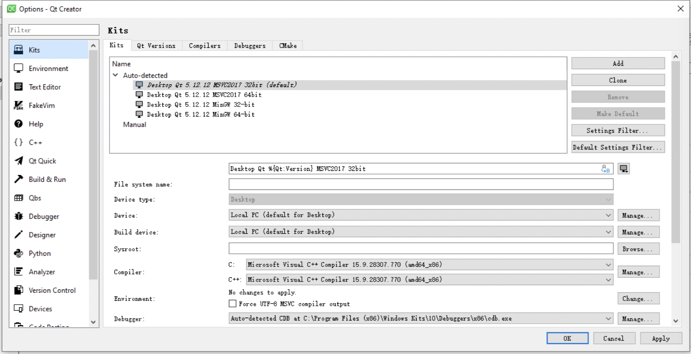
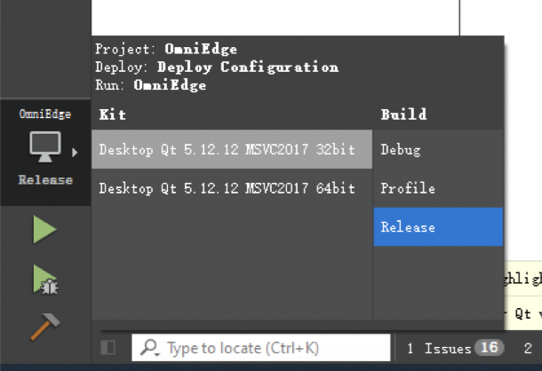

<div align="center">
  <h1>OmniEdge</h1>
<a href="https://omniedge.io"></a>
<a href="https://github.com/omniedgeio/omniedge"></a>
<a href="https://github.com/omniedgeio/omniedge"></a>
<a href="https://github.com/omniedgeio/omniedge/releases"></a>
<a href="https://hub.docker.com/r/omniedge/omniedge"></a>
<a href="https://hub.docker.com/r/omniedge/omniedge"></a>

  <br />
  <br />
  <a href="https://omniedge.io/docs/article/install#get-started">Get Started</a>
  <span>&nbsp;&nbsp;•&nbsp;&nbsp;</span>
  <a href="https://omniedge.io/">Website</a>
  <span>&nbsp;&nbsp;•&nbsp;&nbsp;</span>
  <a href="https://omniedge.io/docs">Docs</a>
  <span>&nbsp;&nbsp;•&nbsp;&nbsp;</span>
  <a href="https://omniedge.io/docs/article/development">Development</a>
  <span>&nbsp;&nbsp;•&nbsp;&nbsp;</span>
  <a href="https://omniedge.io/docs/article/cases/">Examples Cases</a>
  <span>&nbsp;&nbsp;•&nbsp;&nbsp;</span>
  <a href="https://discord.gg/FY6Yd6jcPu">Discord</a>
  <span>&nbsp;&nbsp;•&nbsp;&nbsp;</span>
  <a href="https://twitter.com/omniedgeio">Twitter</a>
  <span>&nbsp;&nbsp;•&nbsp;&nbsp;</span>
  <a href="https://github.com/omniedgeio/omniedge">OmniEdge</a>
  <span>&nbsp;&nbsp;•&nbsp;&nbsp;</span>
<a href="https://buy.stripe.com/4gwcNy54x75RfCw5kw">Donation</a>
  <br />
  <hr />
</div>

[【English】](README.md) [【繁体中文】](README/README-zh-Hant.md) [【简体中文】](README/README-zh-Hans.md) [【日本语】](README/README-JP.md) [【Español】](README/README-ES.md) [【Italiano】](README/README-IT.md) [【한국어】](README/README-KR.md) 
[【العربي】](README/README-AR.md) [【Tiếng Việt】](README/README-VN.md) [【แบบไทย】](README/README-TH.md)

[Hiring: Lead Developer - OmniEdge Enterprise VPN Project](Hiring.md)

OmniEdge is an Open source p2p layer 2 VPN infrastructure based on [n2n](https://github.com/ntop/n2n) protocol, a traditional VPN alternative. No central server, easy to scale with less maintenance. What happens in intranet, stays in in intranet. OmniEdge is fully open sourced the code including backend, frontend, and Apps. 


   


## Key features:

||||
|----|----|----|
|Dashboard administration management| :fire: Mesh VPNs|Desktop GUI apps for MacOS(menubar) and Windows(systray)|
| :fire: Multi virtual networks| :fire: Site-to-Site VPNs|Command line cli apps for Linux,FreeBSD, Raspbian and MacOS|
|Multi users|Unlimited data transfer|Command line cli apps for armv7,arm64,RISC-V64,x86_64 and amd64|
|Multi devices|Encrypted peer-to-peer connection|Mobile apps for iOS and Android|
| :fire: Self-hosted Supernode |Encrypted connection relay|Tablet apps for iPad, Android Tablet and Android TV|
| :fire: Sharing virtual network|Hybrid-cloud support|NAS App for Synology|
|Security Keys| :fire: Zero-Config|Automatic public supernode allocation|
| :fire: [Remote Device Control](https://omniedge.io/docs/article/Cases/VNC)|[Drop Files remotely](https://omniedge.io/docs/article/Cases/landrop) |Automatic IP allocation|


## Supported

| App| Version | Linux | Windows | MacOS | FreeBSD |iOS | Android | Synology |  OpenWrt |Docker | Github Action |
| --------- | ---------- | --- | --- | --- |--- |--- |--- |--- | --- |--- | --- |
| OmniEdge  | [0.2.3](https://github.com/omniedgeio/omniedge/releases/tag/v0.2.3)  | ✅  | ✅  | ✅  | ✅  |✅  |✅  |✅  |✅  |✅ |✅ |
| OmniEdge  | [0.2.4](https://github.com/omniedgeio/omniedge/releases/tag/v0.2.3)  | ✅  |   |   | ✅  |  |  |✅  |✅  |✅ |✅ |
| OmniEdge  | [0.2.5](https://github.com/omniedgeio/omniedge/releases/tag/v0.2.3)  |   |✅  |   | ✅  |  |  |✅  |✅  |✅ |✅ |

## Get Started in 5 minutes 

1. Sign up your account: [Sign up](https://omniedge.io/register)
2. [Download](https://omniedge.io/download) OmniEdge apps for your platform: macOS, linux, FreeBSD, iOS, android and more.
3. Or run the following command if you want to use cli version:
```bash
curl https://omniedge.io/install/omniedge-install.sh | bash
```
4. Login with your Email and password, select your virtual network, connect! 

You are all set! 

And if you want to login with **security key**, or manage your devices, go and check [Documenation](https://omniedge.io/docs) for more.

### Docker

Bring container into intranet.

```bash
sudo docker run -d \
  -e OMNIEDGE_SECURITYKEY=OMNIEDGE_SECURITYKEY \
  -e OMNIEDGE_VIRUTALNETWORK_ID="OMNIEDGE_VIRUTALNETWORK_ID" \
  --network host \
  --privileged \
  omniedge/omniedge:latest
```
### Github Action

Bring Github Action into intranet, access nodes/devices from CI workflows.

```bash
- name: OmniEdge for Github Action
  uses: omniedgeio/github-action@v1
  with:
    securitykey: ${{ secrets.OMNIEDGE_SECURITY_KEY }}
    virtualnetworkid: ${{ secrets.OMNIEDGE_VIRTUALNETWORK_ID }}
```

## Server status 

  >This Server Status is generated every 5 hours by OmniEdge Github action.
  
  [OmniEdge server-status](https://github.com/omniedgeio/server-status#server-status)


## Compile

### Linux

**Install golang for your distribution**

Follow the [instruction](https://go.dev/doc/install) to install golang, we use **1.16.6**, or running the following command:

```bash
wget https://go.dev/dl/go1.16.6.linux-amd64.tar.gz
rm -rf /usr/local/go && tar -C /usr/local -xzf go1.16.6.linux-amd64.tar.gz
export PATH=$PATH:/usr/local/go/bin
go version
```


####  Build for Ubuntu 18.04, 20.04, 22.04/Debian 10, 11

```bash
sudo apt-get -y update
sudo apt-get install -y openssl build-essential libssl-dev zip autoconf
git clone https://github.com/omniedgeio/omniedge-cli
cd omniedge-cli
go mod download
go generate
BUILD_ENV=prod make build
```

#### Build for Fedora 36, CentOS 8

```bash
sudo yum update
sudo yum -y install gcc-c++ curl wget zip wget git openssl-devel net-tools automake autoconf make
git clone https://github.com/omniedgeio/omniedge-cli
cd omniedge-cli
go mod download
go generate
chmod +x internal/make
BUILD_ENV=prod make build
```

#### Build for Arch(Manjaro)

```bash
sudo pacman -Syu --needed unzip git gcc curl wget zip make pkg-config openssl net-tools automake autoconf make
git clone https://github.com/omniedgeio/omniedge-cli
cd omniedge-cli
go mod download
go generate
chmod +x internal/make
BUILD_ENV=prod make build
```

#### Build for Opensuse

```bash
sudo zypper update 
sudo zypper install unzip git gcc curl wget zip make pkg-config openssl net-tools automake autoconf make tar
git clone https://github.com/omniedgeio/omniedge-cli
cd omniedge-cli
go mod download
go generate
chmod +x internal/make
BUILD_ENV=prod make build
```

The compiled omniedge-cli will be found in **/out/**

### BSD

#### FreeBSD

```bash
su
pkg update && pkg install go gmake git openssl zip autoconf automake libtool
git clone https://github.com/omniedgeio/omniedge-cli
cd omniedge-cli
go mod download
go generate
BUILD_ENV=prod make build-freebsd
```

The compiled omniedge-cli will be found in **/out/**

### Cross Compile

#### Compile for RISCV64

Host OS: Ubuntu 20.04

```bash
apt-get update
apt-get install -y openssl autoconf build-essential libssl-dev zip wget g++-riscv64-linux-gnu gcc-riscv64-linux-gnu

wget https://go.dev/dl/go1.18.4.linux-amd64.tar.gz
rm -rf /usr/local/go && tar -C /usr/local -xzf go1.18.4.linux-amd64.tar.gz
export PATH=$PATH:/usr/local/go/bin
go version
export GOOS=linux
export GOARCH=riscv64
export CGO_ENABLED=1
export CC=riscv64-linux-gnu-gcc
git clone https://github.com/omniedgeio/omniedge-cli.git
cd omniedge-cli
go mod download
go generate
BUILD_ENV=prod make build-riscv64
```

The compiled omniedge-cli will be found in **/out/**

### Android

1. Download Android Studio: https://developer.android.com/studio
2. Get the repo and compile

```bash
git clone https://github.com/omniedgeio/omniedge-android.git`
./gradlew test --stacktrace
./gradlew assembleDebug --stacktrace
```

We have also prepared the CI for Github and Gitlab for building automatically. 

1. Github: https://github.com/omniedgeio/omniedge-android/blob/main/.github/workflows/build.yml
2. GitLab: https://github.com/omniedgeio/omniedge-android/blob/main/.gitlab-ci.yml


###  iOS

1. Download and install Xcode
2. Get the repo and compile

```bash
git clone https://github.com/omniedgeio/omniedge-iOS.git
cd omniedge-iOS
open OmniEdgeNew/OmniEdgeNew.xcworkspace
```

Xcode will open automatically, you have to set your developer account to start the compile. We recommend compiling the package on your devices separately, specially the **Tunnel** package. 


### macOS

#### macOS GUI

1. Download and install Xcode
2. Get the repo and compile

```bash
git clone https://github.com/omniedgeio/omniedge-macOS.git
cd omniedge-macOS
open Omniedge.xcodeproj
```

Xcode will open automatically, you have to set your developer account to start the compile.

#### macOS Cli

```bash
brew install autoconf automake libtool
git clone https://github.com/omniedgeio/omniedge-cli
cd omniedge-cli
go mod download
go generate
BUILD_ENV=prod make build-darwin
```

The compiled omniedge-cli will be found in **/out/**

### Windows

1. Download [QT 5.12.12 for windows](https://download.qt.io/official_releases/qt/5.12/5.12.12/) and [Inno Setup for windows](https://jrsoftware.org/isdl.php#stable)
2. Get the repo and compile

```bash
git clone https://github.com/omniedgeio/omniedge-windows.git
cd omniedge-windows
```

3. open **OmniEdge.pro** and **QT Creator** will open automatically
4. Set the Kits to **Desktop Qt 5.12.12 MSVC2017 32bit**, select build with **Release**, set the Build directory to: `.\build-package\build\`





5. Press `crtl+B` to build, and you will find **OmniEdge.exe** in the folder`.\build-package\build\release\`.
6. copy **OmniEdge.exe** to `.\build-package\package\`,open **omniedge_withTAP_V02_bat.iss** with Inno Setup Compile, press `ctril+F9` to compile and you will find the installer package in the folder `.\build-package\release`

### OpenWrt

1. Compile the binary

We use the github action with the docker to build the binary for openwrt, the docker file is located at:
`https://github.com/omniedgeio/omniedge-cli/blob/dev/docker/openwrt-binary`

2. Package the ipk

A seperated repo `https://github.com/omniedgeio/omniedge-openwrt` with github action is used to download the openwrt binary and package the ipk. 

## Usage

- [Virtual Network, Devices, Security Key, and Settings](https://omniedge.io/docs/article/admin)
- [Windows 7,10,11 for Intel or Arm](https://omniedge.io/docs/article/install/windows)
- [Android](https://omniedge.io/docs/article/install/android)
- [Linux Cli for raspberry Pi, Nvidia Jeston,and more](https://omniedge.io/docs/article/install/cli)
- [MacOS Cli](https://omniedge.io/docs/article/install/macoscli)
- [Synology](https://omniedge.io/docs/article/install/synology)
- [Docker](https://omniedge.io/docs/article/install/docker)
- [Github Action](https://omniedge.io/docs/article/install/github-action)
- [iOS](https://omniedge.io/docs/article/install/ios)
- [Setup custom supernode](https://omniedge.io/docs/article/install/customize-supernode)


## Use Cases

> Tell us your use-case, so we can share to others

- [Remote connect windows without exposing public IP with Omniedge](https://omniedge.io/docs/article/Cases/RDP)
- [Display and control macOS, Linux and Windows ](https://omniedge.io/docs/article/Cases/VNC)
- [Keep connection with your AI based Project on Jetson](https://omniedge.io/docs/article/Cases/jetson)
- [Display and control your Android device with Omniedge from anywhere on MacOS, Windows and Linux](https://omniedge.io/docs/article/Cases/android-remote)
- [Talk to your family and share photos in a LAN on the internet](https://omniedge.io/docs/article/Cases/lan-messenger)
- [Air Drop Any Files between MacOS, Windows, Routers, Linux and Android with Omniedge from anywhere](https://omniedge.io/docs/article/Cases/landrop)

## Compare

- [VPN vs. OmniEdge](https://omniedge.io/docs/article/compare/vpn-vs-omniedge)
- [Express VPN vs. OmniEdge](https://omniedge.io/docs/article/compare/expressvpn-vs-omniedge)
- [frp/ngrok vs. OmniEdge](https://omniedge.io/docs/article/compare/frp-ngrok-vs-omniedge)
- [ZeroTier vs. OmniEdge](https://omniedge.io/docs/article/compare/zerotier-vs-omniedge)
- [n2n vs. OmniEdge](https://omniedge.io/docs/article/compare/n2n-vs-omniedge)

## Who are talking about us

- [Founded by a Single Tweet Startup OmniEdge’s effort to let connect without concern](https://threat.technology/founded-by-a-single-tweet-startup-omniedges-effort-to-let-connect-without-concern/)
- [voonze: OmniEdge, to access your Intranet from the Internet using P2P](https://voonze.com/omniedge-to-access-your-intranet-from-the-internet-using-p2p/)
- [wwwhatsnew: OMNIEDGE, PARA ACCEDER A TU INTRANET DESDE INTERNET USANDO P2P](https://wwwhatsnew.com/2022/03/03/omniedge-para-acceder-a-tu-intranet-desde-internet-usando-p2p/)
- [l'Entrepreneur: OmniEdge, pour accéder à votre Intranet depuis Internet en P2P](https://lentrepreneur.co/style/technologie/omniedge-pour-acceder-a-votre-intranet-depuis-internet-en-p2p-04032022)
- [RunaCapital: Awesome OSS alternatives](https://github.com/RunaCapital/awesome-oss-alternatives)
- [OmniEdge in ntopconf 2022](https://www.ntop.org/ntopconf2022/)

## Advisor

[lucaderi](https://github.com/lucaderi)

## Contributors

[harri8807](https://github.com/orgs/omniedgeio/people/harri8807) , [Tex-Tang](https://github.com/Tex-Tang), [ivyxjc](https://github.com/orgs/omniedgeio/people/ivyxjc), [kidylee](https://github.com/kidylee), [EbenDang](https://github.com/orgs/omniedgeio/people/EbenDang)
,[zteshadow](https://github.com/zteshadow), [ChenYouping](https://github.com/orgs/omniedgeio/people/ChenYouping),[ddrandy](https://github.com/orgs/omniedgeio/people/ddrandy), **Tsingv**, [mtx2d](https://github.com/mtx2d)，[Blackrose](https://github.com/Blackrose), [cheung-chifung](https://github.com/cheung-chifung),[我不是矿神](https://imnks.com/5768.html)


>feel free to tell us about any posts related us via issue or PR. 

----

If you have more questions, feel free to talk to us at [Discussions](https://github.com/omniedgeio/omniedge/discussions).
