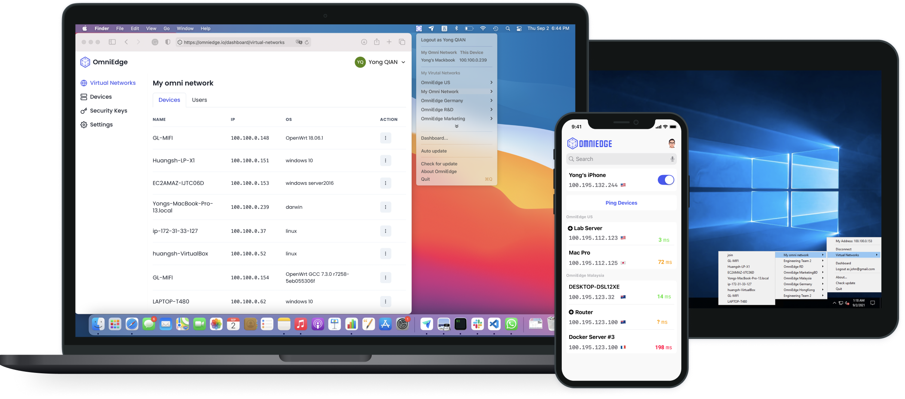

<div align="center">
  <h1>OmniEdge</h1>
<a href="https://omniedge.io"></a>
<a href="https://github.com/omniedgeio/omniedge"></a>
<a href="https://github.com/omniedgeio/omniedge"></a>
<a href="https://github.com/omniedgeio/omniedge/releases"></a>
<a href="https://hub.docker.com/r/omniedge/omniedge"></a>
<a href="https://hub.docker.com/r/omniedge/omniedge"></a>


  <br />
  <br />
  <a href="https://omniedge.io/docs/article/install#get-started">Get Started</a>
  <span>&nbsp;&nbsp;•&nbsp;&nbsp;</span>
  <a href="https://omniedge.io/">Website</a>
  <span>&nbsp;&nbsp;•&nbsp;&nbsp;</span>
  <a href="https://omniedge.io/docs">Docs</a>
  <span>&nbsp;&nbsp;•&nbsp;&nbsp;</span>
  <a href="https://omniedge.io/docs/article/development">Development</a>
  <span>&nbsp;&nbsp;•&nbsp;&nbsp;</span>
  <a href="https://omniedge.io/docs/article/cases/">Examples Cases</a>
  <span>&nbsp;&nbsp;•&nbsp;&nbsp;</span>
  <a href="https://discord.gg/FY6Yd6jcPu">Discord</a>
  <span>&nbsp;&nbsp;•&nbsp;&nbsp;</span>
  <a href="https://twitter.com/omniedgeio">Twitter</a>
  <span>&nbsp;&nbsp;•&nbsp;&nbsp;</span>
  <a href="https://github.com/omniedgeio/omniedge">OmniEdge</a>
  <br />
  <hr />
</div>

[【English】](../README.md) [【繁体中文】](README-zh-Hant.md) [【简体中文】](README-zh-Hans.md) [【日本语】](README-JP.md) [【Español】](README-ES.md) [【Italiano】](README-IT.md) [【한국어】](README-KR.md) 
[【العربي】](README-AR.md) [【Tiếng Việt】](README-VN.md) [【แบบไทย】](README-TH.md)

OmniEdge là cơ sở hạ tầng VPN lớp 2 p2p mã nguồn mở dựa trên giao thức [n2n](https://github.com/ntop/n2n), một giải pháp thay thế VPN truyền thống. Không có máy chủ trung tâm, dễ mở rộng quy mô với ít bảo trì hơn. Điều gì xảy ra trong mạng nội bộ, vẫn ở trong mạng nội bộ.
   


## Các tính năng chính:

||||
| ---- | ---- | ---- |
| Quản lý quản trị bảng điều khiển | Mesh VPN | Ứng dụng GUI trên máy tính để bàn cho MacOS (menubar) và Windows (systray) |
| Nhiều mạng ảo | VPN Site-to-Site | Các ứng dụng cli dòng lệnh cho Linux, FreeBSD, Raspbian và MacOS |
| Nhiều người dùng | Truyền dữ liệu không giới hạn | Các ứng dụng cli dòng lệnh cho armv7, arm64, RISC-V64, x86_64 và amd64 |
| Nhiều thiết bị | Kết nối ngang hàng được mã hóa | Ứng dụng di động cho iOS và Android |
| Supernode tự lưu trữ | Chuyển tiếp kết nối được mã hóa | Ứng dụng máy tính bảng cho iPad, Android Tablet và Android TV |
| Chia sẻ mạng ảo | Hỗ trợ đám mây lai | Ứng dụng NAS cho Synology |
| Khóa bảo mật | Zero-Config | Phân bổ supernode công khai tự động |
| [Điều khiển thiết bị từ xa](https://omniedge.io/docs/article/Cases/VNC) | [Thả tệp từ xa](https://omniedge.io/docs/article/Cases/landrop) | Phân bổ IP tự động |


Bạn có thể tìm thêm các tính năng trong Trang [Định giá] (https://omniedge.io/pricing) dành cho Doanh nghiệp.

## Bắt đầu sau 5 phút

1. Đăng ký tài khoản của bạn: [Đăng ký] (https://omniedge.io/register)
2. [Tải xuống] (https://omniedge.io/download) Ứng dụng OmniEdge cho nền tảng của bạn
3. Hoặc chạy lệnh sau nếu bạn muốn sử dụng phiên bản cli:
`` bash
curl https://omniedge.io/install/omniedge-install.sh | bấu víu
``
4. Đăng nhập bằng Email và mật khẩu của bạn, chọn mạng virut của bạn, kết nối!

Bạn đã sẵn sàng!

Và nếu bạn muốn đăng nhập bằng ** khóa bảo mật ** hoặc quản lý thiết bị của mình, hãy truy cập và kiểm tra [Documenation] (https://omniedge.io/docs) để biết thêm.

## Biên dịch

### OmniEdge Cli

1. Môi trường: Golang 1.16.6
2. Biên dịch:

- 2.1. Ubuntu /linux

```bash
sudo apt-get -y update
sudo apt-get install -y openssl build-essential libssl-dev zip autoconf
git clone https://github.com/omniedgeio/omniedge-cli
cd omniedge-cli
go mod download
go generate
BUILD_ENV=prod make build
```

- 2.2. macOS

```bash
brew install autoconf automake libtool
git clone https://github.com/omniedgeio/omniedge-cli
cd omniedge-cli
go mod download
go generate
BUILD_ENV=prod make build-darwin
```

- 2.3. freebsd

```bash
su
pkg update && pkg install go gmake git openssl zip autoconf automake libtool
git clone https://github.com/omniedgeio/omniedge-cli
cd omniedge-cli
go mod download
go generate
BUILD_ENV=prod make build-freebsd
```

3. Biên dịch chéo

- 3.1 RISC-V 

Máy chủ hệ điều hành: Ubuntu 20.04

```bash
apt-get update
apt-get install -y openssl autoconf build-essential libssl-dev zip wget g++-riscv64-linux-gnu gcc-riscv64-linux-gnu

wget https://go.dev/dl/go1.18.4.linux-amd64.tar.gz
rm -rf /usr/local/go && tar -C /usr/local -xzf go1.18.4.linux-amd64.tar.gz
export PATH=$PATH:/usr/local/go/bin
go version
export GOOS=linux
export GOARCH=riscv64
export CGO_ENABLED=1
export CC=riscv64-linux-gnu-gcc
git clone https://github.com/omniedgeio/omniedge-cli.git
cd omniedge-cli
go mod download
go generate
BUILD_ENV=prod make build-riscv64
```

Omniedge-cli đã biên dịch sẽ được tìm thấy trong ** / out / **

### OmniEdge Android

1. Tải xuống Android Studio: https://developer.android.com/studio
2. Nhận repo và biên dịch

```bash
git clone https://github.com/omniedgeio/omniedge-android.git`
./gradlew test --stacktrace
./gradlew assembleDebug --stacktrace
```

Chúng tôi cũng đã chuẩn bị CI cho Github và Gitlab để xây dựng tự động.

1. Github: https://github.com/omniedgeio/omniedge-android/blob/main/.github/workflows/build.yml
2. GitLab: https://github.com/omniedgeio/omniedge-android/blob/main/.gitlab-ci.yml


### OmniEdge iOS

1. Tải xuống và cài đặt Xcode
2. Nhận repo và biên dịch

```bash
git clone https://github.com/omniedgeio/omniedge-iOS.git
cd omniedge-iOS
open OmniEdgeNew/OmniEdgeNew.xcworkspace
```

Xcode sẽ tự động mở, bạn phải đặt tài khoản nhà phát triển của mình để bắt đầu biên dịch. Chúng tôi khuyên bạn nên biên dịch gói trên các thiết bị của mình một cách riêng biệt, đặc biệt là gói **Tunnel**.


### OmniEdge-macOS

1. Tải xuống và cài đặt Xcode
2. Nhận repo và biên dịch

```bash
git clone https://github.com/omniedgeio/omniedge-macOS.git
cd omniedge-macOS
open Omniedge.xcodeproj
```

Xcode sẽ tự động mở, bạn phải đặt tài khoản nhà phát triển của mình để bắt đầu biên dịch.

### OmniEdge-windows

1. Tải xuống và cài đặt QT
2. Nhận repo và biên dịch

```bash
git clone https://github.com/omniedgeio/omniedge-windows.git
cd omniedge-windows
```

mở **OmniEdge.pro** và bắt đầu biên dịch.


## Cách sử dụng

- [Virtual Network, Devices, Security Key, and Settings](https://omniedge.io/docs/article/admin)
- [Windows 7,10,11 for Intel or Arm](https://omniedge.io/docs/article/install/windows)
- [Android](https://omniedge.io/docs/article/install/android)
- [Linux Cli for raspberry Pi, Nvidia Jeston,and more](https://omniedge.io/docs/article/install/cli)
- [MacOS Cli](https://omniedge.io/docs/article/install/macoscli)
- [Synology](https://omniedge.io/docs/article/install/synology)
- [Docker](https://omniedge.io/docs/article/install/docker)
- [Github Action](https://omniedge.io/docs/article/install/github-action)
- [iOS](https://omniedge.io/docs/article/install/ios)
- [Setup custom supernode](https://omniedge.io/docs/article/install/customize-supernode)

## Trường hợp sử dụng

> Cho chúng tôi biết trường hợp sử dụng của bạn để chúng tôi có thể chia sẻ với những người khác

- [Remote connect windows without exposing public IP with Omniedge](https://omniedge.io/docs/article/Cases/RDP)
- [Display and control macOS, Linux and Windows ](https://omniedge.io/docs/article/Cases/VNC)
- [Keep connection with your AI based Project on Jetson](https://omniedge.io/docs/article/Cases/jetson)
- [Display and control your Android device with Omniedge from anywhere on MacOS, Windows and Linux](https://omniedge.io/docs/article/Cases/android-remote)
- [Talk to your family and share photos in a LAN on the internet](https://omniedge.io/docs/article/Cases/lan-messenger)
- [Air Drop Any Files between MacOS, Windows, Routers, Linux and Android with Omniedge from anywhere](https://omniedge.io/docs/article/Cases/landrop)

## So sánh

- [VPN vs. OmniEdge](https://omniedge.io/docs/article/compare/vpn-vs-omniedge)
- [Express VPN vs. OmniEdge](https://omniedge.io/docs/article/compare/expressvpn-vs-omniedge)
- [frp/ngrok vs. OmniEdge](https://omniedge.io/docs/article/compare/frp-ngrok-vs-omniedge)
- [ZeroTier vs. OmniEdge](https://omniedge.io/docs/article/compare/zerotier-vs-omniedge)
- [n2n vs. OmniEdge](https://omniedge.io/docs/article/compare/n2n-vs-omniedge)

## Ai đang nói về chúng tôi

- [Founded by a Single Tweet Startup OmniEdge’s effort to let connect without concern](https://threat.technology/founded-by-a-single-tweet-startup-omniedges-effort-to-let-connect-without-concern/)
- [voonze: OmniEdge, to access your Intranet from the Internet using P2P](https://voonze.com/omniedge-to-access-your-intranet-from-the-internet-using-p2p/)
- [wwwhatsnew: OMNIEDGE, PARA ACCEDER A TU INTRANET DESDE INTERNET USANDO P2P](https://wwwhatsnew.com/2022/03/03/omniedge-para-acceder-a-tu-intranet-desde-internet-usando-p2p/)
- [l'Entrepreneur: OmniEdge, pour accéder à votre Intranet depuis Internet en P2P](https://lentrepreneur.co/style/technologie/omniedge-pour-acceder-a-votre-intranet-depuis-internet-en-p2p-04032022)
- [RunaCapital: Awesome OSS alternatives](https://github.com/RunaCapital/awesome-oss-alternatives)
- [OmniEdge in ntopconf 2022](https://www.ntop.org/ntopconf2022/)

## Advisor

[lucaderi](https://github.com/lucaderi)

## Contributors

[harri8807](https://github.com/orgs/omniedgeio/people/harri8807) , [Tex-Tang](https://github.com/Tex-Tang), [ivyxjc](https://github.com/orgs/omniedgeio/people/ivyxjc), [kidylee](https://github.com/kidylee), [EbenDang](https://github.com/orgs/omniedgeio/people/EbenDang)
,[zteshadow](https://github.com/zteshadow), [ChenYouping](https://github.com/orgs/omniedgeio/people/ChenYouping),[ddrandy](https://github.com/orgs/omniedgeio/people/ddrandy), **Tsingv**, [mtx2d](https://github.com/mtx2d)，[Blackrose](https://github.com/Blackrose), [cheung-chifung](https://github.com/cheung-chifung),[我不是矿神](https://imnks.com/5768.html)

> Vui lòng cho chúng tôi biết về bất kỳ bài đăng nào liên quan đến chúng tôi thông qua vấn đề hoặc PR.

----

Nếu bạn có thêm câu hỏi, vui lòng nói chuyện với chúng tôi tại [Discussions](https://github.com/omniedgeio/omniedge/discussions).