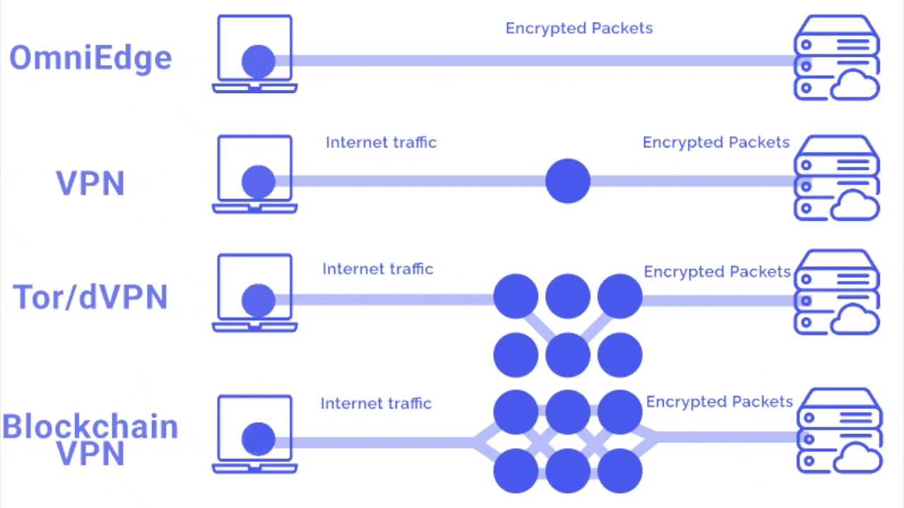

**庆祝 OmniEdge 开源，我们推出了7天免费活动，从7月1号到7号。coupon code “opensource". 任何新用户都可参与，免费时间一年，任何plan都可以。使用网站：https://omniedge.io**

# OmniEdge 

**因特网上的私有网络时代**

>OmniEdge 的端到端企业 VPN 解决方案，无需公网 IP，无需端口转发，无需反向代理，零配置，不仅适用于初创业团队、个人，也适用于需要弹性扩张，在世界各地拥有成千上万台电脑的大公司。局域网的事情，就要放在局域网。

[【简体中文】](README-zh-Hans.md)  [【繁体中文】](README-zh-Hant.md) [【English】](../README-ZH.md)

我们需要您用您的语言翻译本 README, [OmniEdge Windows UI](https://github.com/omniedgeio/omniedge-windows/tree/dev/languages) 和 [Docs](https://github.com/omniedgeio/docs) 。

Chat with us: [🤝 网站](https://omniedge.io) [💬 Twitter](https://twitter.com/omniedgeio) [😇 Discord](https://discord.gg/d4faRPYj)

## 源代码

- 自定义认证节点：https://github.com/omniedgeio/docker-customize-supernode
- 客户端原代码: 
    - [Windows](https://github.com/omniedgeio/omniedge-windows)
    - [macOS (Intel, M1/M2 MacBook)](https://github.com/omniedgeio/omniedge-macOS)
    - [iOS](https://github.com/omniedgeio/omniedge-iOS) 
    - [Android 安卓](https://github.com/omniedgeio/omniedge-android)
    - [群晖版本](https://github.com/omniedgeio/omniedge-synology)  
    - [Linux Cli](https://github.com/omniedgeio/omniedge-cli)
- 协议： https://github.com/omniedgeio/n2n


## 安装 OmniEdge

在官方网站 https://omniedge.io 注册账号，同时下载对应设备的客户端： 

-   [Windows](https://omniedge.io/install/download/0.2.3/omniedge-setup-0.2.3.exe)
-   [iOS & M1 Mac on App Store](https://apps.apple.com/us/app/omniedgenew/id1603005893)
-   [Android: OmniEdge.apk](https://omniedge.io/install/download/0.2.2/omniedge-release-v0.2.2.apk)
-   [CLi for macOS, Linux, Raspberry Pi, ARM and Nvidia Jetson](https://omniedge.io/install/download/0.2.3/omniedgecli-macos-latest.zip)
    ```bash
    curl https://omniedge.io/install/omniedge-install.sh | bash
    ```
-   [群晖](https://omniedge.io/download/synology)


## OmniEdge的优势



----

如果您有更多问题，请去[Discord](https://discord.gg/d4faRPYj) 提问。
