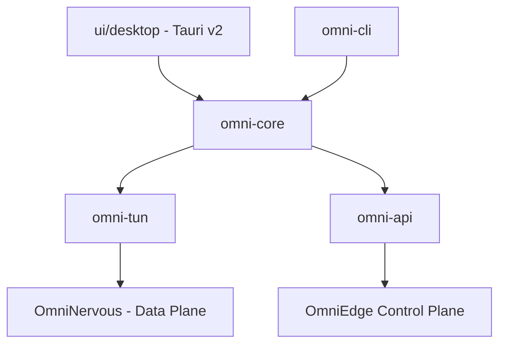

# OmniEdge Architecture

The new OmniEdge architecture is built from the ground up in pure Rust, emphasizing performance, memory safety, and modularity.

## Component Overview

### 1. omni-core (The Orchestrator)
The central logic engine of OmniEdge.
- **ConnectionManager**: Manages the lifecycle of a VPN connection (Authenticating -> Joining -> Connected).
- **State Machine**: Ensures predictable transitions and handles auto-reconnection logic.
- **Routing**: Platform-specific logic for managing system routing tables and DNS hijacking.

### 2. omni-tun (The Interface)
Manages the virtual network interface (TUN).
- Abstraction layer over `OmniNervous`'s userspace WireGuard implementation.
- Handles cross-platform interface creation (Linux, macOS, Windows).
- Provides health metrics (rx/tx, handshake status) to the core.

### 3. omni-api (The Communicator)
Asynchronous REST client for the OmniEdge API.
- **AuthService**: Handles OAuth2 and API key authentication.
- **DeviceService**: Manages device registration and high-frequency heartbeats.
- **NetworkService**: Faciliates network discovery and peering metadata exchange.

### 4. ui/desktop (The Shell)
A modern desktop interface built with Tauri v2 and React.
- **System Tray**: Native integration for background operation.
- **IPC Bridge**: Securely invokes `omni-core` commands from the frontend.
- **Aesthetics**: Premium, macOS-inspired design system.

### 5. OmniNervous (The Data Plane)
A high-performance, userspace WireGuard implementation derived from `boringtun`.
- Optimized for mesh networking with peer-to-peer discovery.
- Shared as a library across the OmniEdge workspace.

## Key Design Principles
- **Memory Safety**: No `unsafe` blocks in the core logic.
- **Zero-Config**: Automatic exit node discovery and routing.
- **High Availability**: Exponential backoff and automated handshake recovery.
- **Permissive Licensing**: Apache 2.0 / MIT for maximum community adoption.
