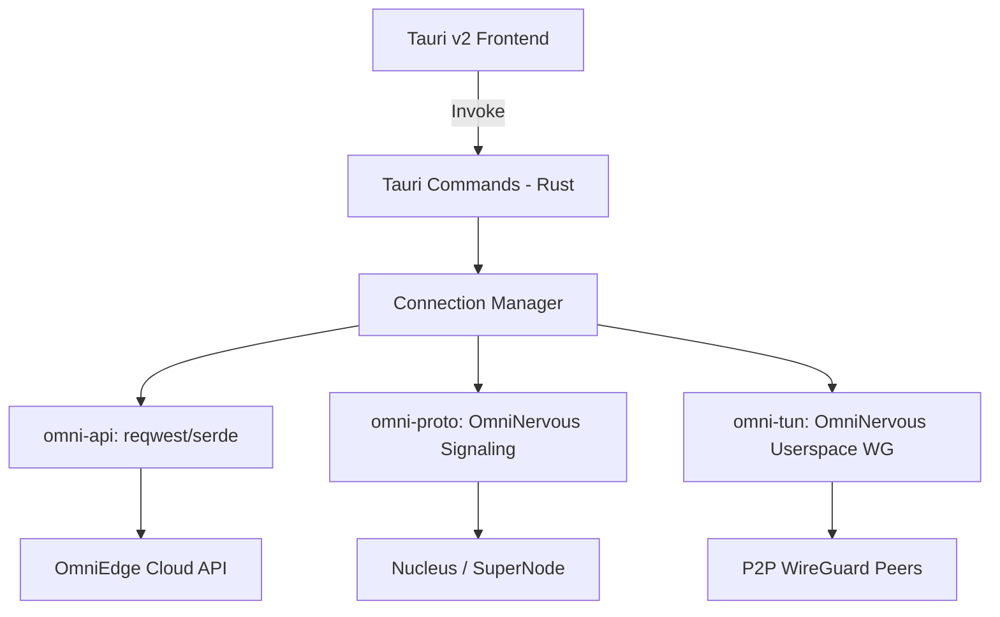

# OmniEdge Migration Plan: Full Rust Logic (OmniNervous Powered)

This document details the transition of OmniEdge from its current Go/C (GPL3/n2n) architecture to a pure Rust (Apache 2.0 / MIT) stack leveraging the `OmniNervous` protocol and data plane.

## Goals
- **License Compliance**: Move from GPL3 (`n2n`) to Apache 2.0 / MIT.
- **Performance**: High-speed userspace WireGuard via `OmniNervous`.
- **Ecosystem**: Unified Rust codebase for Windows, macOS, Linux, and Mobile (via Tauri v2).
- **Simplicity**: Eliminate CGO and complex Go/C interop.

## Concept Mapping (n2n → OmniNervous)

To ensure a smooth transition, the following legacy `n2n` concepts are mapped to their `OmniNervous` equivalents:

| n2n Concept | OmniNervous Equivalent | Role |
|:---|:---|:---|
| **CommunityName** | **Cluster** | Logical grouping of nodes within a network. |
| **SuperNode** | **Nucleus** | Central signaling, NAT traversal, and peer registry. |
| **SecretKey** | **Cluster PSK** | HMAC-SHA256 key for authenticating signaling messages. |

## CLI Parity (Legacy → Rust)

The new Rust CLI (`omni-cli`) must maintain 100% compatibility with the legacy Go CLI for scripts and automation.

| Command | Legacy Flag | Rust Parity | Notes |
|:---|:---|:---|:---|
| `login` | `-u`, `-p`, `-s` | Supported | Includes Interactive and OAuth2 Device Flow. |
| `join` | `-n`, `-r`, `-e` | Supported | Includes Interactive Network Selection. |
| `start` | `-f`, `-r`, `-e` | Supported | Loads session from persistent state. |
| `scan` | `-c`, `-t` | Supported | Local subnet mapping. |
| `upload` | N/A | Supported | Subnet reporting to backend. |

## Architecture: The "Nervous" Spine

The new architecture replaces the n2n/Go core with a componentized Rust workspace.

## Component Mapping (Detailed)

### 1. `omni-proto` (Depend on `omninervous` package)
*   **Logic**: Use signaling and discovery modules directly from the `omninervous` library.
*   **n2n Translation**:
    *   Replaces the legacy n2n registration packets with `MSG_REGISTER` and `MSG_HEARTBEAT`.
    *   Uses **Cluster** strings (formerly CommunityName) for peer isolation.
    *   Implements **Cluster PSK** (formerly SecretKey) via HMAC-SHA256 for signaling integrity.
    *   **CLI Mapping**: Maps `--nucleus` to the legacy `SuperNode` and `--cluster` to legacy `CommunityName`.

### 2. `omni-tun` (Depend on `omninervous` package)
*   **Logic**: Leverage the `WgInterface` and `UserspaceWgControl` from the `omninervous` library.
*   **Responsibility**:
    *   Platform-agnostic TUN management.
    *   Multi-peer userspace WireGuard encryption/decryption (via `boringtun`).
    *   Routing table management (replacing Go's `routing.go`).

### 3. `omni-api` (Ported from Go `pkg/api`)
*   **Logic**: Port `auth.go`, `session.go`, and `virtual_network.go`.
*   **Responsibility**:
    *   OAuth2 with PKCE flow.
    *   Security Key persistence via platform-native keychains.
    *   Network configuration retrieval.

## Migration Phases

### Phase 1: Workspace Initialization & Core Foundation
- [ ] **OmniNervous Refactor**: Convert `omninervous` to a `lib` + `bin` structure.
    - [ ] Create `OmniNervous/crates/daemon/src/lib.rs`.
    - [ ] Export `signaling`, `wg`, `handler`, `identity`, and `peers` modules.
- [ ] Setup Rust Workspace in `omniedge/crates`.
- [ ] **omni-proto**: Create library dependent on `omninervous`.
- [ ] **omni-tun**: Create library dependent on `omninervous`.
- [ ] **omni-api**: Port registration and network listing logic from Go to Rust.

### Phase 2: Connection Manager (The Glue)
- [ ] Implement a unified "Connection State Machine" in Rust.
- [ ] Handle transition: Login -> Join Network -> Signaling Bind -> TUN Up.
- [ ] Port routing logic from `pkg/core/routing.go` to native Rust.

### Phase 3: Tauri v2 Integration
- [ ] Initialize Tauri v2 in `ui/desktop`.
- [ ] Port existing React/Vite assets from `shell/desktop/frontend`.
- [ ] Implement System Tray and Popover using Tauri native plugins.
- [ ] Replace bridge-service IPC with Tauri `invoke` commands.

### Phase 4: License & Document Cleanup [DELETE GPL3]
- [ ] Audit every file in `omniedge`.
- [ ] Remove `Makefile` (Go-centric) and replaced with `cargo` workflows.
- [ ] Update `LICENSE` and `LICENSING.md` to reflect the new Apache/MIT status.
- [ ] Remove `pkg/`, `cmd/`, and `protocol/` folders once verified.

### 5. Build System
*   **Unified Makefile**: Providing a single entry point for multi-platform builds.
*   **Targets**: `x86_64` (Intel/AMD) and `aarch64` (ARM) for all major OSs.
*   **Automation**: Preparing for GitHub Actions integration.

## Verification Plan

### Automated
- **Signaling Test**: Verify registration success with Nucleus using mock API.
- **Data Plane Test**: `iperf3` between two Rust nodes over the virtual interface.
- **Cross-Platform CI**: GitHub Actions build for Linux, Windows, macOS (Intel/ARM).

### Manual
- **Hole Punching**: Verify P2P establishment behind Symmetric NAT.
- **UI Responsiveness**: Verify tray interaction and connection state updates.
