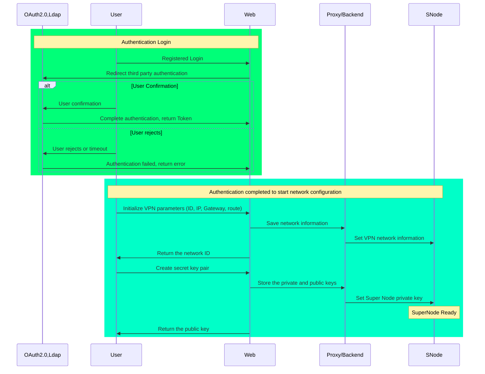
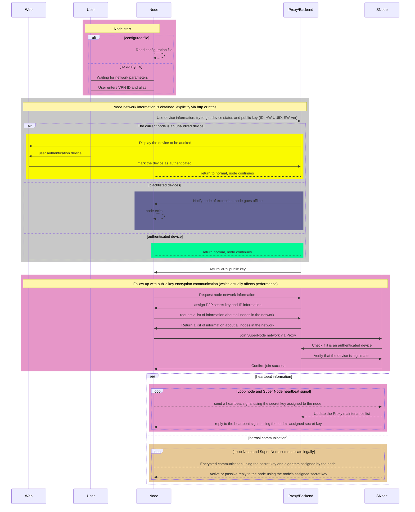
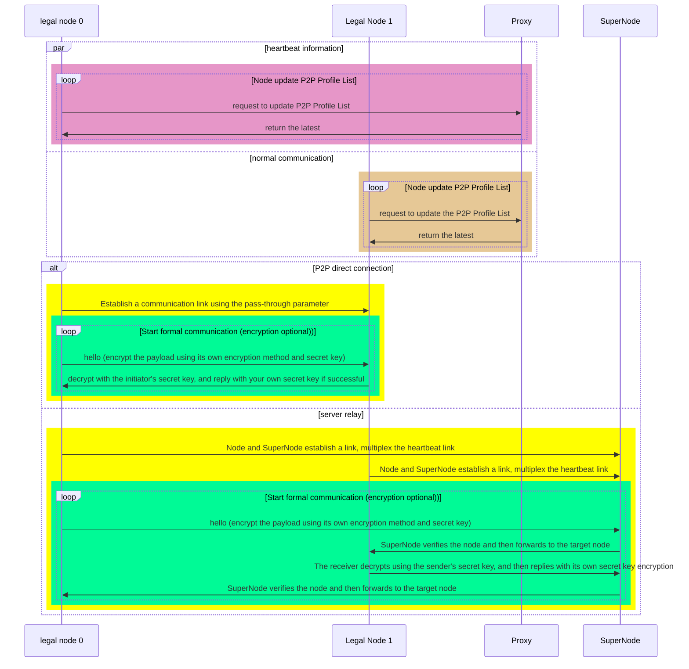
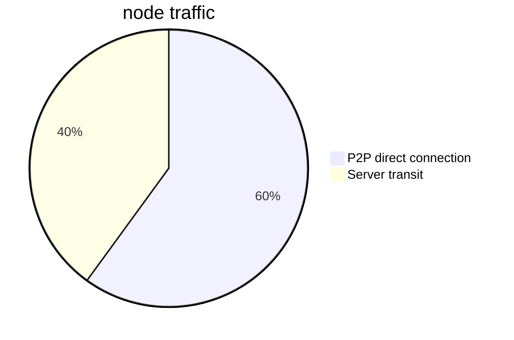

Short description of the term.
- Proxy here I did not distinguish between Proxy, Worker, Web Backend
- Web here refers to the user's management interface, including and not limited to Web / App

## 1: User initialization/management network

## 2: Node joins the network for the first time

## Node joins the network

## 3: Node P2P communication

When communicating between two nodes, both parties need to make sure their P2P Profile List is up-to-date and each maintains information about the P2P devices in the network

### P2P direct penetration communication

## Security protection

### 1: Self-protection of nodes

Nodes may have possible data leakage during use

| Possibility | Description | Solution Ideas |
| ---- | ---- | ---- |
| public key data | public key is not worried about losing | try not to store it locally, and use https encryption during the acquisition process |
| https hijacking | https hijacking | calibrate https public key |
| P2P Profile List secret key leak | hole-punching and encryption information leakage throughout the network | data is updated regularly, node self-checking, proximity node detection and timely blackout |

### 2: Active prevention of data leakage

The possibility of leakage includes.

| possibility | description | solution ideas |
| ---- | ---- | ---- | 
| Storage | Store sensitive data locally | Try to store in memory and obfuscate |
| debug crack | memory intrusion crack | program self-check and add anti-debug code, and promptly notify the proxy to pull the hack |

## Brief description of data structure

P2P Profile List Info

For each device in the P2P network, there is a structure to describe its P2P profile as follows
| Key | Type | Comment |
| ---- | ---- | ---- |
| old n2n | struct | original n2n parameters |
| encryp_type | int | Encryption method, such as cha20 symmetric encryption |
| compress_type | int | Compression methods, such as gzip
| key | char[64] | The secret key of the current node |
| timeout | uint64_t | The time out deadline of the current profile |

## Data traffic analysis

